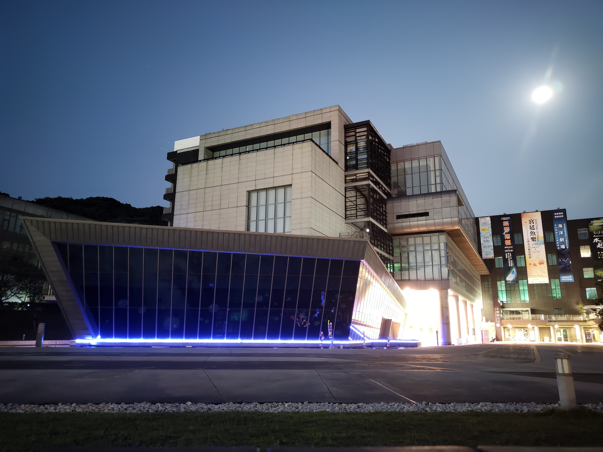
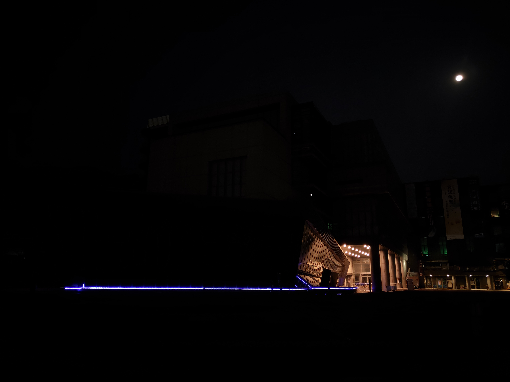
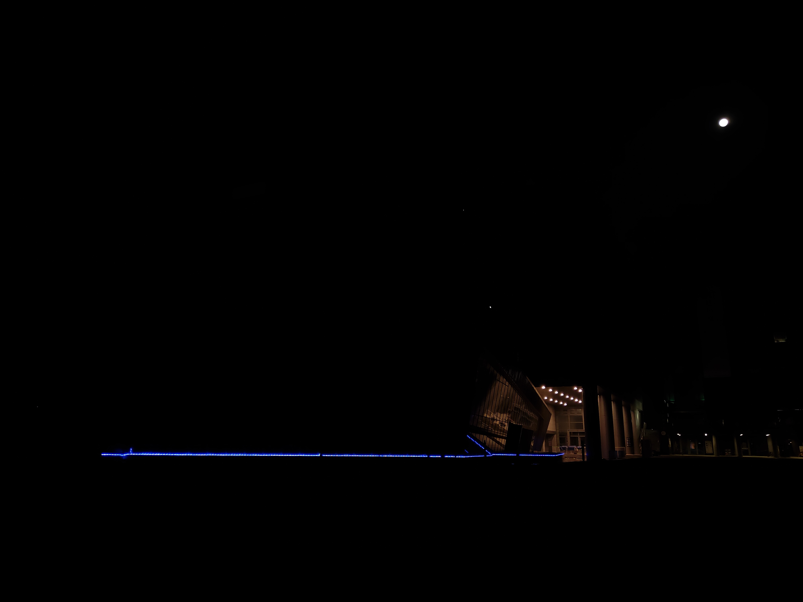
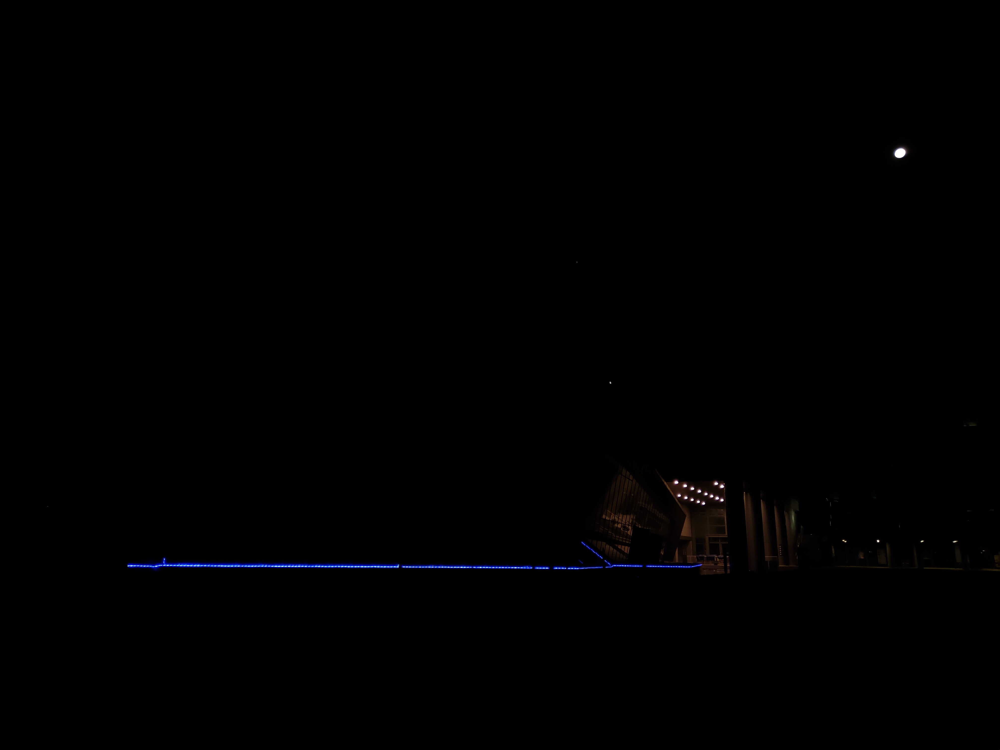
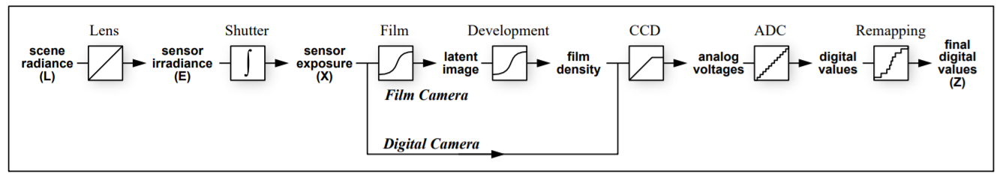
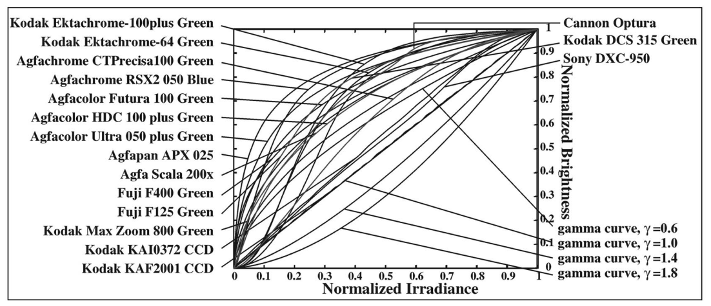

# ImageProcessing HDR

## 實作項目

* [ImageProcessing HDR](#imageprocessing-hdr)
  * [實作項目](#實作項目)
  * [輸入圖片](#輸入圖片)
  * [成果展示](#成果展示)
    * [HDR](#hdr)
      * [概念](#概念)
      * [HDR 演算法設計](#hdr-演算法設計)
    * [Tone Mapping](#tone-mapping)
      * [Global Tone Mapping](#global-tone-mapping)
      * [Local Tone Mapping](#local-tone-mapping)

## 輸入圖片

|快門|16|8|4|2|
|:---:|:---:|:---:|:---:|:---:|
|照片|||||
|**快門**|**1**|**1/2**|**1/4**|**1/8**|
|照片|||||
|**快門**|**1/16**|**1/32**|**1/64**|
|照片||||

## 成果展示

||||
|:---:|:---:|:---:|
|我們的 HDR 與使用 Photoshop 轉成 JPG|Local ACES|Local Reinhard Enhance|

### HDR

* 實作論文 [Recovering High Dynamic Range Radiance Maps from Photographs. In SIGGRAPH 97, August 1997.](http://www.pauldebevec.com/Research/HDR/)

#### 概念

* 此為相機獲得 $Z$ 的流程
  
  而我們的目標就是從 $Z$ 還原到 $E$，再將多張不同曝光時間的圖結合，獲得 HDR 的圖片
* 每一家相機所使用的 Response Function 都不一樣，而我們的目標就是要還原這個 Response Function 的反函數，即可將 $Z$ 還原到 $E$
  

#### HDR 演算法設計

* 首先先定義 Response Function 為 $f$
  * 其中 $Z_{ij} = f(E_i\triangle t_j)$
  * 經過 $f$ 後，轉換為 $0$ ~ $255$
* 我們的目標就是求出：$f^{-1}$，其中 $f^{-1}(Z_{ij}) = E_i\triangle t_j$
  * $\ln (f^{-1}(Z_{ij})) = \ln E_i+\ln \triangle t_j$
  * 定義 $g(x)=\ln (f^{-1}(Z_{ij}))$
  * $g(Z_{ij}) = \ln E_i+\ln \triangle t_j$
* 設定 constraint 避免無限多組解
  * $g(Z_{mid})=0$
* $O=\displaystyle\sum^N_{i=1}\displaystyle\sum^P_{j=1}[g(Z_{ij}-\ln E_i-\ln\triangle t_j)]^2+\lambda \displaystyle\sum^{Z_{\max}-1}_{Z_{\min}+1}g''(z)^2$
  * 其中 $N$ 表示像素數，$P$ 代表圖片數
  * 加入後項希望讓結果平滑，$\lambda$ 為可設的參數
  * $g$ 只會有 $256$ 個輸入、$E$ 有 $N$ 個，所以可以直接用對照表儲存
  * 目標：求得 $\min O(g, E_i)$
* 加入 Weighting Funciton，加強中間的值
  * 
  * $w(z)=-(z-128)*(z-128)\div 65 + 256$
* 將 $O$ 拆解成 $\begin{bmatrix}a_{11}&a_{12}\\\text{constraint}&0\\a_{12}&0\end{bmatrix}\begin{bmatrix}x_{1}\\x_{2}\end{bmatrix}=\begin{bmatrix}b_1\\b_2\end{bmatrix}$ 的形式
  * 並使用 $x = (A^TA)^{-1}A^TB$ 求出 $x$
  * $x_1$
    * $256 \times 1$ 大小的矩陣
    * 描述 Row 所代表的 $Z$ 值對應的 $g(Z)$
  * $a_{11}$ 
    * $NP \times 256$ 大小的矩陣
    * Row 代表某一張圖片的某一個像素
    * 在每一個 Row 的對應的 $Z$ 值所對應的 Column 填上 $w(Z)$ ，其餘為 $0$
  * $a_{12}$ 
    * $NP \times N$ 大小的矩陣
    * Row 代表某一張圖片的某一個像素
    * 在每一個 Row 的對應的第 $i$ 個 Column 填上 $-w(Z)$ ，其餘為 $0$
  * $a_{21}$ 
    * $254 \times 256$ 大小的矩陣
    * 描述 $g''(z)=g(z−1)−2g(z)+g(z+1)$
  * $b_1$ 
    * 為 $NP \times 1$ 大小的矩陣
    * 描述 $w(Z_{ij})\ln\Delta t_j$
* 取樣點
  * 需要取 $N(P-1) > (Z_{\max}-Z_{\min})$，而我們預設取 $900$ 個點
  * 均勻的分布點，讓圖片不同亮度都可以被取樣到
* 求出每一張圖的每一個像素的 $E$ 值後，將多張圖合併到一張
  * 使用權重以保留品質較高的顏色
  * $\ln E_i=\dfrac{\displaystyle\sum^P_{j=1}w(Z_{ij})(g(Z_{ij})-\ln \triangle t_j)}{\displaystyle\sum^P_{j=1} w(Z_{ij})}$
* 以上為 R, G, B channel 分開操作

### Tone Mapping

#### Global Tone Mapping

* 計算照片的平均亮度
  * 將所有的像素的 $E$ 值加總並平均，以下稱作  $\text{lumAvg}$ 
* 使用多種方式來將 $E$ mapping 至 $0$~$1$ 之間
  * ACES(default)
    * 將 $\text{color}$ 乘上  $\text{lumAvg}$  後，作為 $\text{color}'$
    * $\dfrac{\text{color}'\times(A\times \text{color}' + B)}{\text{color}'\times(C \times \text{color}'+D)+E}$
    * 其中參數設為 $A=2.51, B=0.03, C=2.43, D=0.59, E=0.14$
  * Reinhard
    * 自定義灰值 $\text{gray}$ ，我們將它設為 $1$
    * 將 $\text{color}$ 乘上 $\text{gray}$  並除上 $\text{lumAvg}$ 後，作為 $\text{color}'$
    * $\dfrac{\text{color}'}{1+\text{color}'}$
  * CE
    * $1-\exp(-\text{lumAvg}\times \text{color})$
  * Uncharted2
    * 自定義白值 $\text{white}$，我們將它設為 $11.2$
    * 定義一個 function 為 $f(x)=\dfrac{x(Ax+CB)+D E}{x(Ax+B)+DF}-\dfrac{E}{F}$
    * $f(1.6\times \text{lumAvg}\times\text{color})\div f(\text{white})$

#### Local Tone Mapping

* 實作 Photographic Tone Reproduction for Digital Images
* 計算出 $\text{OriginLum}$ 為 $\dfrac{a}{\text{average of }\ln(Z)}\times \ln(Z)$
  * $\text{a}$ 可以由使用者自訂，代表 LDR 的亮度
* 計算出分別計算出 $\text{level}$ 為 $1$~$9$ 跟 $2$~$10$ 的 Gaussian Filter Kernel，分別稱 $\text{R1}, \text{R2}$
  * $G(x, y) = \dfrac{1}{2\pi\sigma^2}e^{-\frac{x^2+y^2}{2\sigma^2}}$
  * $\sigma=\text{alpha} \times \text{ratio}^{\text{level}-1}$
  * $\text{alpha}$ 跟 $\text{ratio}$ 可以由使用者自訂，分別代表 Gaussian Filter 的初始值與 $\text{level}$ 間的比例
* 將 $\text{R1}$, $\text{R2}$ 對 $\text{OriginLum}$ 做捲積，獲得 $\text{V1}$, $\text{V2}$
* 計算 $V$ 為 $V = (V1-V2)\div(c+V1))$
  * $c$ 為 $2^\text{phi}\times\dfrac{\text{a}}{\sigma^2}$，避免分母接近 $0$
  * $\text{phi}$ 可以由使用者自訂，代表圖片的銳利度
* 尋找每個像素的 $\min \text{level}$ 符合 $V < \text{epsilon}$ 作為 $\text{level}'$ 
  * $\text{epsilon}$ 可以由使用者自訂，代表 gradient 間的最大差距
* $\text{OriginLum}\div(1+\text{level}')$ 值，作為他的 Local 亮度 $\text{LocalLum}$
* $\text{LocalLum}\div \ln(Z)$ 值，作為他的 Local 平均亮度 $\text{lumAvg}$
* 後續與 Global 相同，使用 ACES、Reinhard、CE、Uncharted2，將值 mapping 回 $0$~$255$
